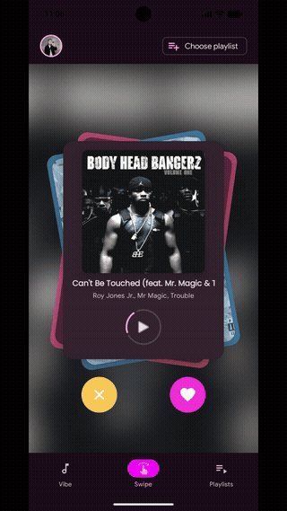
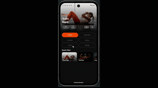

# Hi, I'm Sara 👋

### Backend Developer | Android Developer | UI/UX Enthusiast

Backend and mobile developer building real-world applications with clean architecture, APIs, and user-focused design. Currently working as **Backend Developer Intern at Belgem**, developing production systems with Java, Spring Boot, and PostgreSQL.

📍 Barcelona, Spain · Open to Remote & Hybrid  
🎓 Multiplatform Application Development (DAM) — Ilerna Barcelona  
💼 Open to backend, software engineering, and Android roles

---

## 🧰 Tech Stack

### Backend

### Mobile

### Database

### Design

### Tools

---

## About Me

Backend developer with hands-on experience building production systems using Java, Spring Boot, and Kotlin. I recently graduated in Multiplatform Application Development (DAM) and I'm currently working as a Backend Developer Intern at Belgem, where I design and implement modular REST APIs, apply clean (hexagonal) architecture principles, and work with PostgreSQL for data persistence.

I care about writing maintainable, well-structured code and building systems that scale. Alongside backend development, I also build Android apps with Kotlin and Jetpack Compose, and I bring a design background that helps me approach products from both a technical and visual perspective.

I'm looking for my next opportunity in backend development, software engineering, or Android — based in Barcelona, remote or hybrid.

---

## 🚀 Featured Projects

### 🎧 SongSwipe

Android application inspired by swipe-based interaction for music discovery.

Technologies:
- Kotlin
- Jetpack Compose
- REST APIs

👉 [View Project](projects/songswipe/songswipe.md)

---

### 🏋️ GymSpot Lite

Fitness app built with Kotlin Multiplatform targeting Android, Desktop, Web, and iOS from a single codebase. Browse exercises from the Wger API, create routines, track favorites, and execute workouts with sets, reps, and rest timers.

Technologies:
- Kotlin Multiplatform
- Compose Multiplatform
- Supabase
- Ktor Client

👉 [View Project](projects/gymspot-lite/gymspot-lite.md)

---

### 💎 Belgem Backend

Backend system developed with Java and Spring Boot following a modular clean architecture, built during my internship at Belgem.

Technologies:
- Java
- Spring Boot
- PostgreSQL
- REST API
- Clean Architecture (Hexagonal)

👉 [View Project](projects/belgem/belgem-backend.md)

---

### 🏋️ Gym BDOR

Database project focused on modeling a complete gym management system.

Technologies:
- SQL
- PostgreSQL
- Database Design

👉 [View Project](projects/gym-bdor/gym-bdor.md)

---

## 🎨 Design Work

This portfolio also includes visual and product-related work created with Figma and Adobe tools.

👉 [View Design Work](design)

---

## 📄 CV

👉 [View CV](cv)

---

## 📫 Contact

GitHub · [github.com/selfishara](https://github.com/selfishara)  
LinkedIn · [linkedin.com/in/sara-martinez-bascuas-740b34155](https://www.linkedin.com/in/sara-martinez-bascuas-740b34155/)  
Email · [saramb10.smb@gmail.com](mailto:saramb10.smb@gmail.com)
