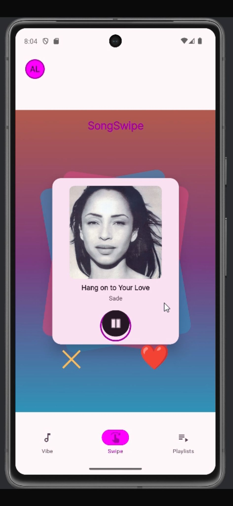

# Hi, I'm Sara 👋

Backend & Mobile Developer in progress, currently focused on building real-world applications using modern technologies.

I enjoy working on projects that combine **clean architecture, APIs, and user-focused design**.

---

## 🚀 Featured Projects

### 🎧 SongSwipe
Mobile app inspired by swipe-based interaction for discovering music.

- Kotlin & Jetpack Compose  
- Modern UI/UX  
- API integration  

👉 [View Project](projects/songswipe/songswipe.md)

---

### 💎 Belgem Backend
Backend system built with a modular and scalable architecture.

- Java & Spring Boot  
- Clean Architecture (Hexagonal)  
- REST APIs & database integration  

👉 [View Project](projects/belgem/belgem-backend.md)

---

### 🗺️ Maps App
Android app focused on map interaction and marker management.

- Kotlin & Jetpack Compose  
- Maps SDK integration  
- Supabase backend  

👉 [View Project](projects/mapsapp/mapsapp.md)

---

### 🎬 Ghibli API App
Application that consumes and displays data from the Studio Ghibli API.

- Retrofit & REST APIs  
- JSON handling  
- Dynamic UI  

👉 [View Project](projects/ghibli/ghibli-api.md)

---

### 🏋️ Gym Database (BDOR)
Database design project focused on relational modeling.

- PostgreSQL  
- SQL & data modeling  
- Entity relationships  

👉 [View Project](projects/gym-bdor/gym-bdor.md)

---

### 🏗️ GymSpot (In Progress)
Fitness application currently in development.

- Product design & architecture  
- Supabase & data layer  
- Feature-based structure  

👉 [View Project](projects/gymspot/gymspot.md)

---

## 🧰 Tech Stack

- **Languages:** Java, Kotlin, SQL  
- **Backend:** Spring Boot, REST APIs  
- **Mobile:** Jetpack Compose  
- **Database:** PostgreSQL, Supabase  
- **Tools:** Git, GitHub, Android Studio, IntelliJ  

---

## 📫 Contact

- LinkedIn: [(Linkedin)](https://www.linkedin.com/feed/)
- Email: saramb10.smb@gmail.com

---

⭐ Always open to learning, collaborating, and building new projects.
