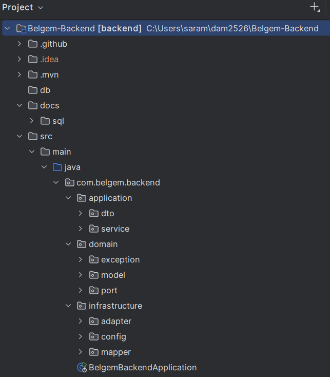
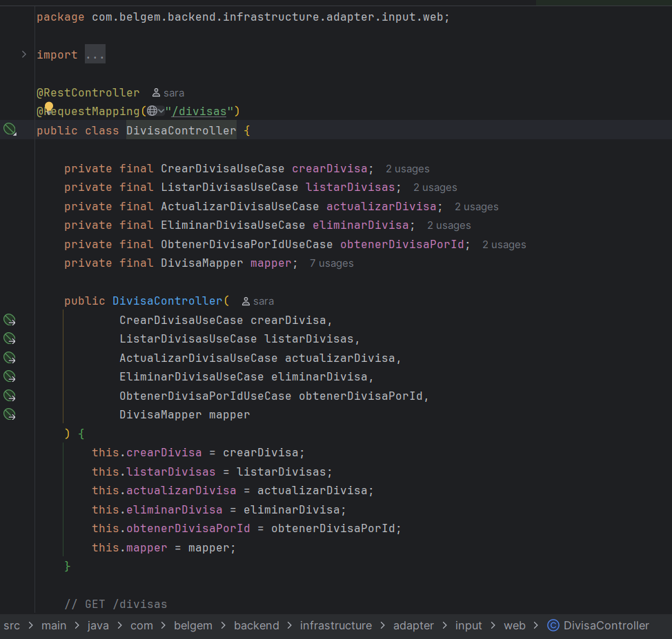

# Belgem Backend

## Overview

Belgem Backend is a backend system developed with Java and Spring Boot, focused on building a modular and scalable API architecture.

The project follows clean backend development practices, separating business logic, persistence, and API layers to maintain a clear and maintainable structure.

The goal of the project is to manage business-related data through a structured backend system.

---

## Technologies Used

- Java
- Spring Boot
- PostgreSQL
- REST APIs
- JPA / Hibernate
- Maven

---

## Backend Architecture

The project follows a modular backend structure separating controllers, services, repositories, and domain logic.

---
## Controller Example

---

## Service Layer

---

## API Endpoints

Example of REST endpoints implemented in the backend.

---

## Database Design

Database schema used to structure the system's data.

---

## Database Tables (Supabase)

Preview of the application tables.

---

## Repository

[Backend](https://github.com/Alfre-dev2004/Belgem-Backend.git)
