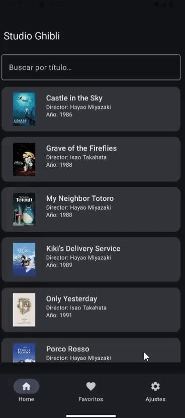
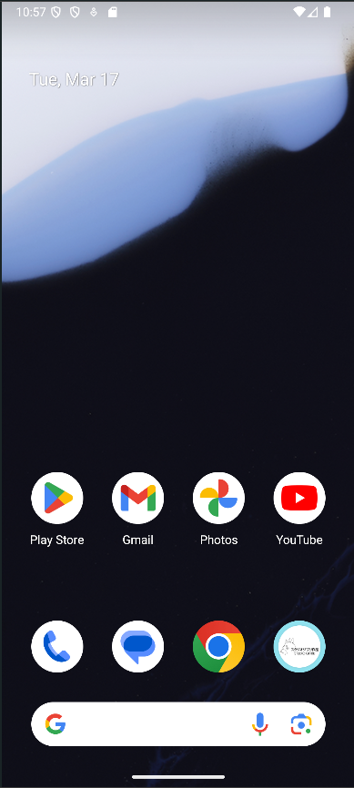
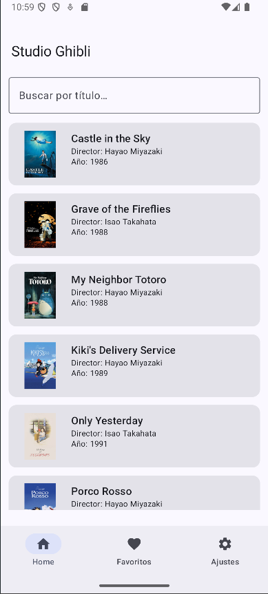
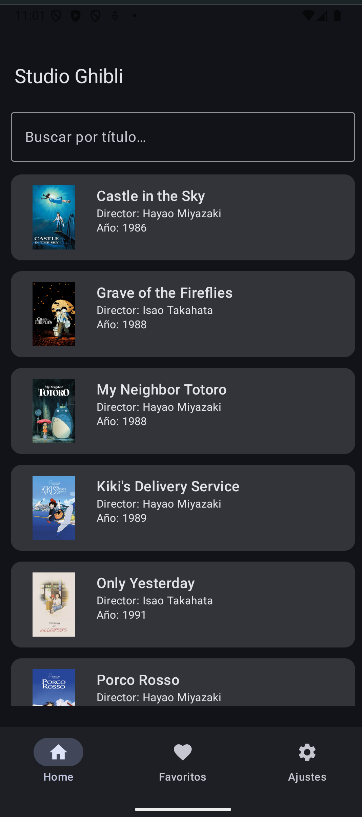
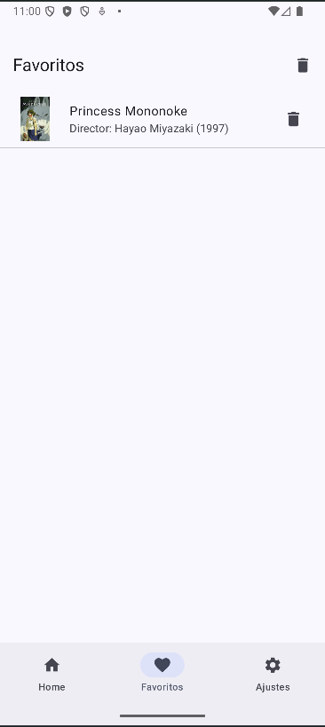
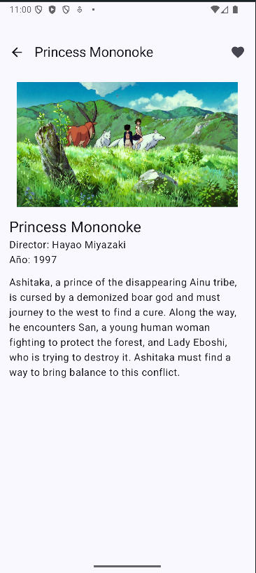
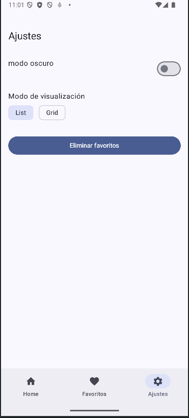

# Studio Ghibli API Project

## Overview

This project was built to consume and display data from the public Studio Ghibli API.

The main goal was to practice working with REST APIs, handling JSON responses, and integrating external data into an application in a clean and understandable way.

It helped me strengthen concepts related to API requests, response mapping, and displaying dynamic content in the interface.

---

## Technologies Used

- Kotlin
- REST APIs
- Retrofit
- JSON parsing
- Android Studio

---

## Key Features

- Fetching data from an external public API
- Handling asynchronous network calls
- Mapping JSON responses into application models
- Displaying dynamic API data in the UI

---

## My Role

In this project I worked on:

- API integration
- Network request handling
- Response mapping
- Displaying fetched data in the application interface

---

## User Interface

---

## Repository

[(repository link here)](https://github.com/selfishara/ghibli-api-app.git)
