# Maps App

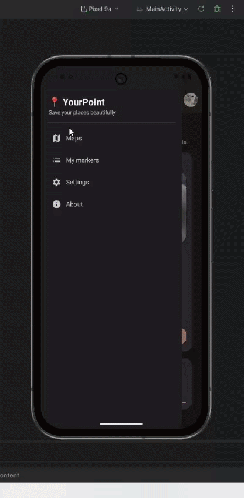

## Overview

Maps App is an Android project focused on map-based interaction and mobile user experience.

The application integrates map functionality, marker interaction, and interface components designed to make geographical interaction clear and intuitive for the user.

This project helped me practice Android development, Compose-based UI, and map integration inside a mobile application.

---

## Technologies Used

- Kotlin
- Jetpack Compose
- Android Studio
- Maps SDK
- REST APIs
- Supabase

---

## Key Features

- Interactive map visualization
- Marker creation and interaction
- Compose-based mobile UI
- User-centered screen layout and navigation
- Authentication and backend integration

---

## My Role

In this project I worked on:

- UI implementation with Jetpack Compose
- Map integration
- Marker interaction logic
- Screen structure and interface layout
- Backend connection with Supabase

---

## Map Functionality

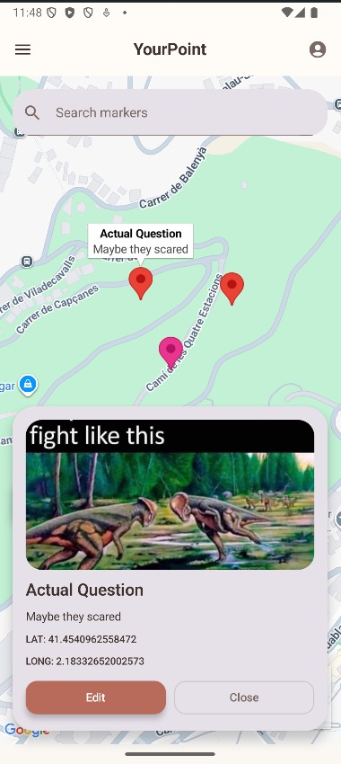
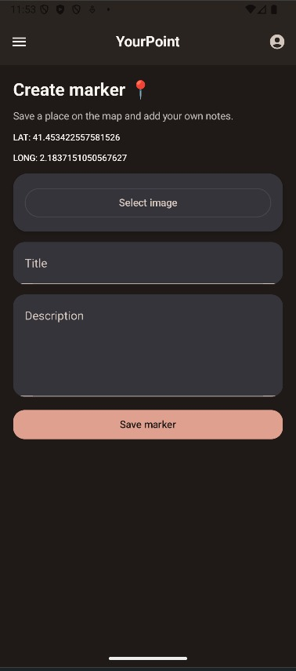

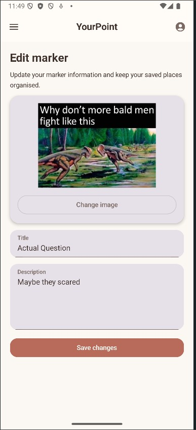
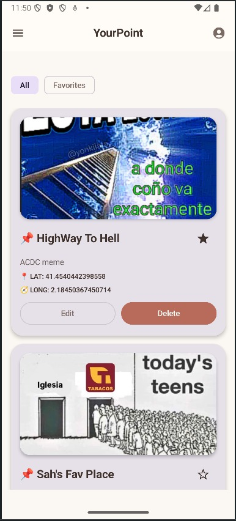

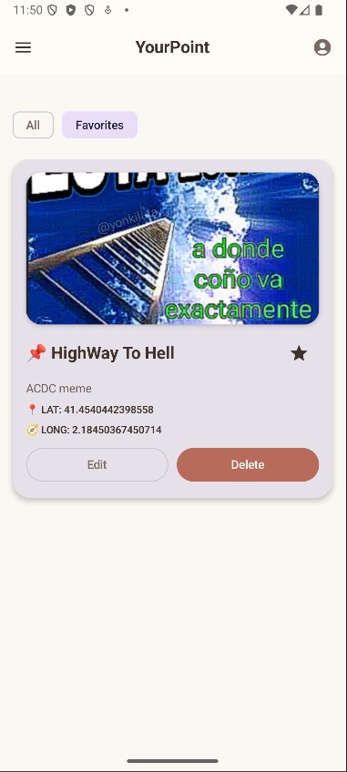

---

## User Interface

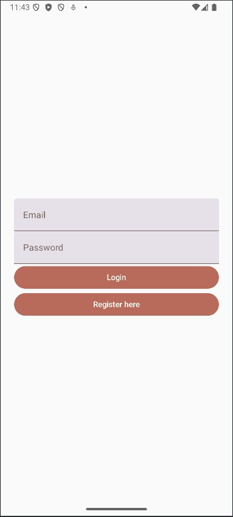
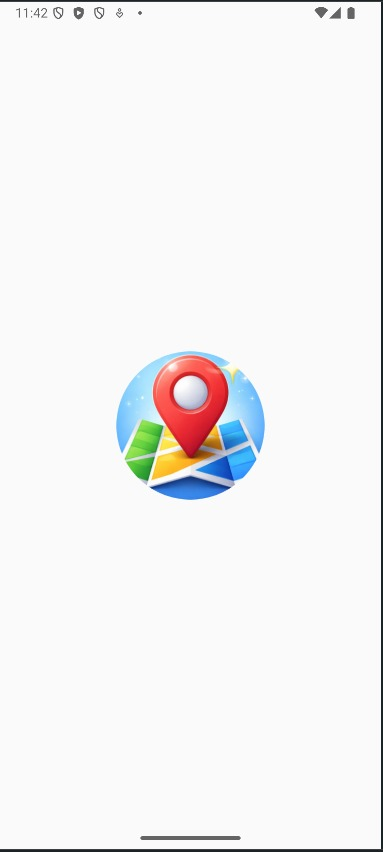

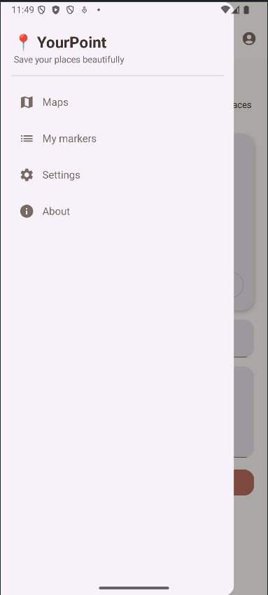
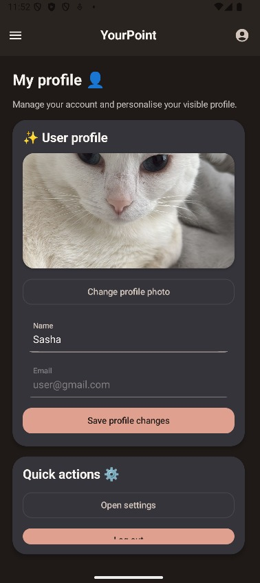

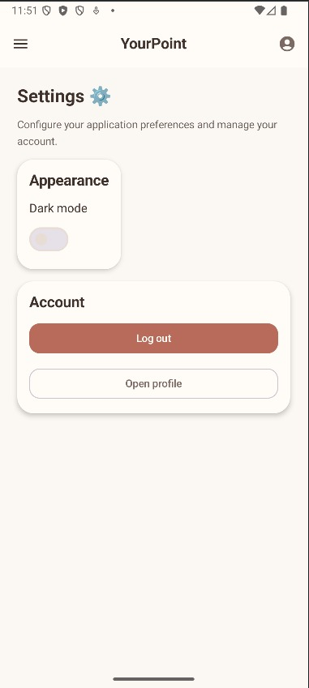
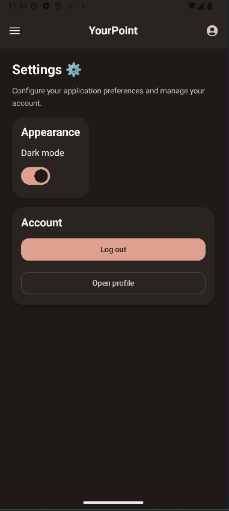

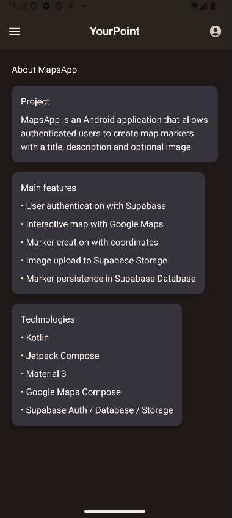
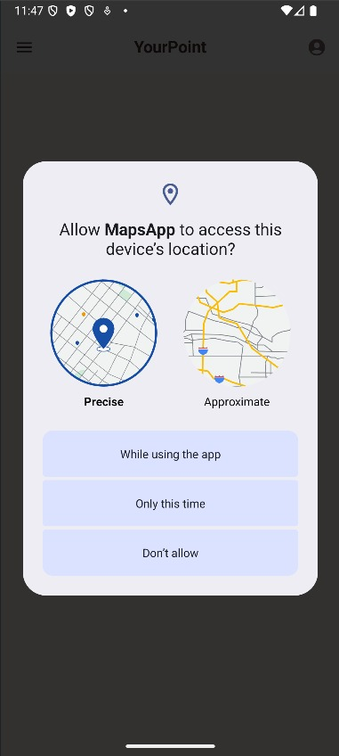

---

## Backend & API (Supabase)

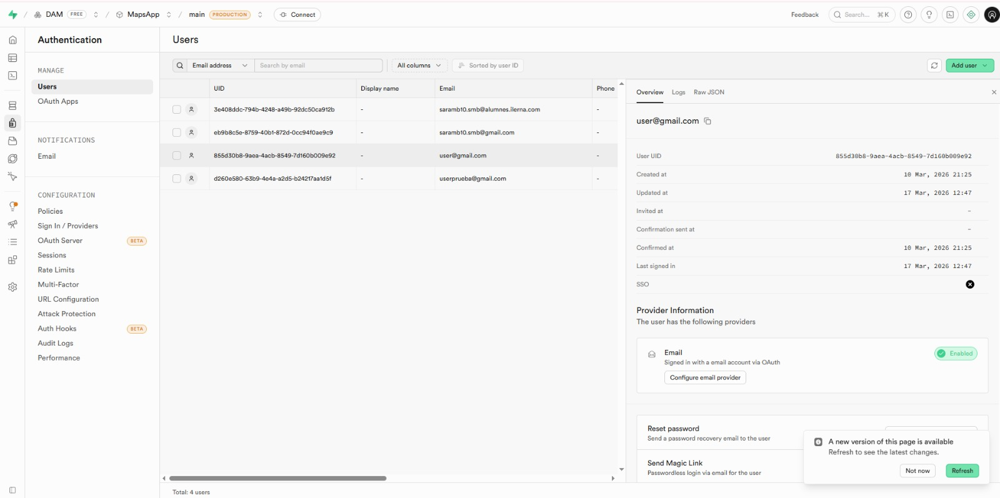

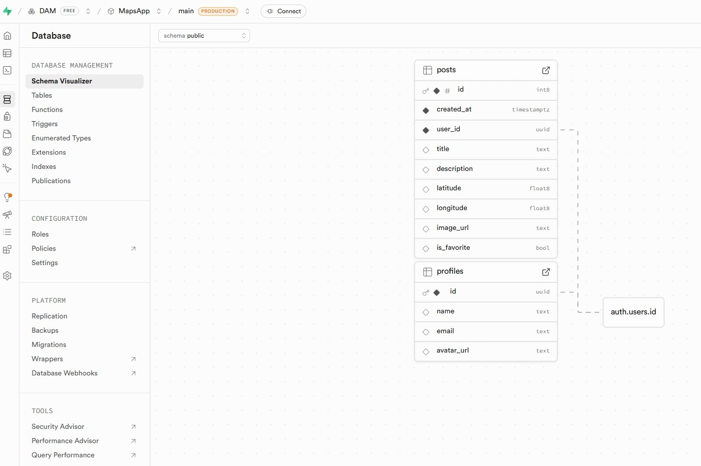

---

## Repository

[(Repository link here)](https://github.com/selfishara/MapsApp.git)
